# TrialSentinel

**Verifiable, injection-robust multi-agent auditing of clinical-trial transparency.**

[](https://github.com/Saheed7/trialsentinel/actions/workflows/ci.yml)


A large share of completed clinical trials never report their results, and safety
problems can surface only after a drug reaches the market. The evidence needed to
spot these gaps is public, but it is scattered across three government systems that
nobody reads together at scale.

TrialSentinel triangulates **ClinicalTrials.gov**, **PubMed**, and **openFDA FAERS**
to surface research-integrity signals, such as unreported results and
disproportionate post-market adverse-event reporting. Its design principle:
**deterministic rules decide what can be verified; LLM agents reason only where rules
cannot, and every claim must cite its evidence.**

> **Status:** Phase 1 (multi-source ingestion with provenance) is complete. The rule
> engine, agents, and AWS deployment are in progress; see the [roadmap](#roadmap).

---

## What it does today

- **Three-source ingestion.** Async clients for ClinicalTrials.gov API v2, NCBI
  E-utilities, and openFDA, with rate limiting, jittered retries on transient
  failures only, and cursor pagination verified against the live APIs.
- **Idempotent, traceable runs.** Content hashing (including parser version) skips
  unchanged records; every run is logged with parameters and counters, and its raw
  payload is archived in date-partitioned JSONL.
- **Evidence provenance.** Each trial-publication link records *how* it was found:
  sponsor-declared, indexer-linked, or text-mention. These are not interchangeable,
  as the findings below show.
- **Pharmacovigilance statistics.** PRR, ROR with 95% CI, and Yates chi-squared for
  drug-event pairs, with the Evans signal criteria. Implemented in-house and
  unit-tested against hand calculations.
- **Correctness by design.** Partial registry dates (`2020-06`) keep their precision,
  so deadline rules can be conservative instead of silently assuming the 1st of the
  month.
- **Security built in.** `defusedxml` blocks XXE and entity-expansion payloads (with a
  test proving it), search terms are allow-listed against query injection, API keys
  are kept out of logs, and gitleaks runs on every commit.

## Early findings (pilot sample)

From 75 completed trials (type 2 diabetes and asthma). **These validate the
method; they are not population estimates.**

| Observation | Result |
|---|---|
| Trials with a sponsor-declared results paper | 8 / 75 |
| Trials linked to papers via PubMed's NCT index | 29 / 75 (**3.6x** registry-only recall) |
| Index links duplicating registry "derived" links | 44 / 48 (92%): one signal, not two |
| Text-mention links confirmed by the paper's databank field | 21 / 21 |
| Linked papers that are reviews, meta-analyses, or letters | 16: "linked" is not "results published" |
| FAERS drug resolution (with reported-name fallback) | 10 / 10 (3 via fallback) |
| Drug-event pairs meeting Evans criteria | 144 / 231 (62%): low specificity |
| Known safety signal recovered blind | pioglitazone / bladder cancer (PRR 80.4) |

The low specificity of standard signal criteria, driven by indication bias and
non-clinical terms, is the motivation for the next phase: typed evidence rules and
shrinkage statistics *before* any agent reasons over a signal. The dated analysis is
in [`docs/research-log.md`](docs/research-log.md).

## Architecture

```mermaid
flowchart LR
  subgraph S["Public sources"]
    CT["ClinicalTrials.gov API v2"]
    PM["PubMed E-utilities"]
    FDA["openFDA FAERS"]
  end
  subgraph I["Ingestion (built)"]
    HTTP["Rate-limited, retrying<br/>async clients"]
    RAW[("Raw archive<br/>JSONL.gz, dt partitions")]
    LIN["Run lineage<br/>ingestion_runs"]
  end
  PG[("PostgreSQL<br/>system of record")]
  subgraph P["Planned"]
    RULES["Rule engine<br/>FDAAA 801, evidence typing"]
    QD[("Qdrant<br/>hybrid retrieval")]
    AG["LangGraph agents<br/>+ grounding verifier"]
    HITL["Conformal<br/>human-review gate"]
    API["FastAPI + Cognito<br/>on AWS"]
  end
  CT --> HTTP
  PM --> HTTP
  FDA --> HTTP
  HTTP --> PG
  HTTP --> RAW
  HTTP --> LIN
  PG --> RULES --> AG
  PG --> QD --> AG
  AG --> HITL --> API
```



Design decisions are recorded as ADRs in [`docs/adr/`](docs/adr/), starting with
[why PostgreSQL holds records and Qdrant holds vectors](docs/adr/0001-postgres-system-of-record-qdrant-for-retrieval.md).

### Data model (current)

| Table | Holds |
|---|---|
| `trials`, `trial_outcomes`, `trial_interventions` | Normalised registry records, dates with precision |
| `publications`, `trial_publication_links` | PubMed records; one link row per evidence type |
| `faers_drugs`, `trial_drug_links` | Drug-name resolution and its route (or failure) |
| `faers_drug_event_stats` | PRR / ROR / chi-squared per pair, per FAERS snapshot |
| `ingestion_runs` | Lineage: parameters, counters, status, raw-archive URI |

## Quickstart

Requires Python 3.12 via [uv](https://docs.astral.sh/uv/) and Docker.

```bash
cp .env.example .env            # add optional NCBI / openFDA API keys
docker compose up -d --wait     # PostgreSQL, Qdrant, Redis
uv sync
uv run alembic upgrade head
uv run pytest
```

Ingest and link a small sample:

```bash
uv run python -m trialsentinel.ingestion.cli ctgov --condition "asthma" --status COMPLETED --max-studies 25
uv run python -m trialsentinel.ingestion.cli pubmed-link --status COMPLETED --limit 25
uv run python -m trialsentinel.ingestion.cli faers --status COMPLETED --limit 25 --max-drugs 5
```

## Engineering practices

- Typed configuration (12-factor), structured JSON logging, Alembic migrations
  with `alembic check` drift detection.
- Pull-request workflow with a protected `main`: CI runs lint, format, and tests
  on every PR.
- Pre-commit hooks pinned through `uv.lock`: ruff, gitleaks, and file hygiene.
- Offline unit tests using mocked transports; no test touches the network.

## Roadmap

- [x] **Phase 0:** foundation: toolchain, CI, local infrastructure
- [x] **Phase 1:** ClinicalTrials.gov, PubMed, and openFDA ingestion with provenance
- [ ] **Phase 2:** rule engine: FDAAA 801 applicability, conservative deadlines,
      typed results-publication evidence, indication-aware signal filtering
- [ ] **Phase 3:** hybrid retrieval: chunking, embeddings, Qdrant dense + sparse search
- [ ] **Phase 4:** LangGraph specialist agents with claim-level grounding verification
- [ ] **Phase 5:** memory and a conformal risk-controlled human-review gate
- [ ] **Phase 6:** API hardening: Cognito auth, RBAC, async jobs, caching
- [ ] **Phase 7:** guardrails and red-teaming against indirect prompt injection
- [ ] **Phase 8:** evaluation harness and benchmark release
- [ ] **Phase 9:** observability, then AWS deployment via Terraform and GitHub Actions OIDC

## Responsible use

TrialSentinel produces **signals for expert review, not conclusions.** A missing
results posting can have legitimate explanations; a FAERS disproportionality signal
reflects reporting patterns, not causation. Nothing here is medical or legal advice.

## License

[Apache-2.0](LICENSE)
